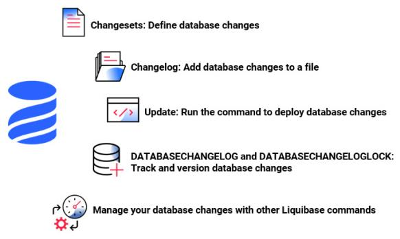

# 我的数据库脚本版本管理之路

## 我们为什么要对数据库脚本做版本管理

首先，让我们从头开始，假设我们有一个名为***Shiny***的项目，其主要交付项目是一个名为***Shiny Soft***的软件，该软件连接到名为***Shiny DB***的数据库。

可以描述此种情景的最简单的图可能看起来像这样：


现在，我们拥有我们的软件和数据库了。非常好。这很可能就是所有你需要的东西了。

但是在大多数项目中，这种简单的世界观很快就会转化为下图这样子：


现在，我们不只需要处理一个环境，而是要处理**多个环境**。这提出了许多挑战。

**在代码层面，我们非常擅长，解决了这些问题：**

- 现在，代码的版本控制已普遍存在，并且每天都有更好的工具。

- 我们拥有可重复制作的版本和持续集成。

- 我们有明确定义的发布和部署过程。


**但是数据库层面呢？**


不幸的是，我们在数据库层面做得不好。许多项目仍然依赖手动应用的SQL脚本。有时甚至就连手动应用的SQL脚本都不行（而是使用现场编写的SQL语句解决问题）。这很快出现了许多问题：

1. 该机器上的数据库处于什么状态？
2. 此脚本是否已经应用？
3. 生产中的快速修复脚本（现场编写的SQL语句等）是否已在测试环境中应用？
4. 如何设置一个新的数据库实例？

这些问题的答案通常是：***我们不知道***。


**这个时候，怎么办呢？**

**数据库脚本的版本管理**就是回答这些问题的好方法。

数据库脚本版本化管理后，你应该可以：

1. 所有数据库脚本入库（代码仓库，如Gitlab、Github等）管理
2. 方便地从零开始重新创建数据库
3. 随时清楚数据库所处的状态
4. 确定性地从当前数据库版本迁移到新版本
5. 无需手工执行数据库脚本变更操作
6. 方便地回退数据库变更


## 我的数据库脚本版本管理之路

### 刀耕火种

我也经历过刀耕火种的年代，即前文描述的手工执行数据库变更脚本。这种操作方式会有多种弊端（前文已说明），所以已摒弃这种方法。

### 脚本化

数据库变更应该有据可循，应该在代码仓库体现所有的变更，同时也应该可以使用变更脚本快速还原与生产一致的数据库，本着如上描述的原则，参照平时的工作经验，设计出如下数据库变更方案，供大家参考。

#### 目录结构

数据库脚本目录结构如下：

- `incremental_scripts`，文件夹，存储增量的`ddl`及`dml`变更脚本。

  - `ddl`，文件夹，存储增量的`ddl`变更脚本。
    - 该文件夹下面以日期为子文件夹存储当日所有的变更脚本。
  - `dml`，文件夹，存储增量的`dml`变更脚本。
    - 该文件夹下面以日期为子文件夹存储当日所有的变更脚本。
  - `entry_scripts`，文件夹，存储增量的引导变更脚本。
    - 该文件夹下面以日期为子文件夹存储当日的增量变更脚本、增量备份脚本以及增量回退脚本。

- `initial_scripts`，文件夹，存储初始化数据库的`ddl`及`dml`变更脚本。

  - `ddl`，文件夹，存储初始化数据库的`ddl`变更脚本。

    - `functions`，文件夹，存储初始化数据库的创建函数变更脚本。
    - `stored_procedures`，文件夹，存储初始化数据库的创建存储过程变更脚本。

    - `tables`，文件夹，存储初始化数据库的创建表变更脚本。

    - `triggers`，文件夹，存储初始化数据库的创建触发器变更脚本。

    - `views`，文件夹，存储初始化数据库的创建视图变更脚本。

  - `dml`，文件夹，存储初始化数据库的`dml`变更脚本。

- `db_setup_all.sql`，全量建库脚本。
- `db_setup_inc.sql`，增量变更脚本。
- `db_backup_inc.sh`，增量备份脚本。
- `db_rollback_inc.sh`，增量回退脚本。

#### 变更规范

- 所有的数据库脚本上线后不允许变更，以保证可以通过脚本快速搭建一套与生产一致的数据库。

- 增量变更脚本应保证可以多次重复执行，得到的数据库状态是一样的，即幂等性。
  - 如：建表前应该先将此表drop，新增记录前应该先将此条记录删除等等。

- 每次增量变更应该新增一个文件夹，在文件夹下面建立入口脚本，此入口脚本调用实际进行变更的脚本。

- 每次增量变更新增的`ddl`文件夹应与`dml`新增的文件夹名称保持一致，方便后续追溯。

- 每次增量变更应同时在`db_setup_all.sql`及`db_setup_inc.sql`脚本中加入本次增量变更的引导脚本。

- 每次修改增量变更的脚本时，应该之前所有的增量执行内容注释掉（或者删除）。

- 每次增量变更应先执行`db_backup_inc.sh`脚本，做本次变更前的备份，然后再执行`db_setup_inc.sql`，进行数据库脚本的增量变更。
  - 如果是第二次或者后续多次执行同一变更，则无需备份。

- 如果本次增量变更存在问题，需要进行回退，应执行`db_rollback_inc.sh`脚本，将本次的增量变更回退到数据库之前的状态。
  - 如果在回退前，需要保存数据库的某些数据，可参照`db_backup_inc.sh`脚本，对数据库进行备份。

#### 脚本示例

脚本示例可参见Gitee上面此工程：[db-script-templates](https://gitee.com/soulcraft/db-script-templates) ，截取部分关键代码示例如下：

- db_backup_inc.sh

```Shell
#!/usr/bin/env bash


# 增量备份脚本

# 在执行增量脚本之前需要执行此脚本对数据库进行备份操作

# 每次新增增量备份脚本，需要将之前原有的增量备份脚本全部注释


#source incremental_scripts/entry_scripts/20200218/backup_20200218.sh

#

source incremental_scripts/entry_scripts/20200325/backup_20200325.sh
```

- db_rollback_inc.sh

```Shell
#!/usr/bin/env bash


# 增量还原脚本

# 如果本次增量脚本有问题，则需要执行此脚本对数据库进行还原操作

# 每次新增增量还原脚本，需要将之前原有的增量还原脚本全部注释


#source incremental_scripts/entry_scripts/20200218/rollback_20200218.sh

#

source incremental_scripts/entry_scripts/20200325/rollback_20200325.sh
```

- db_setup_all.sql

```SQL
use `demo`;


-- 全量建库脚本

-- 用于快速搭建一套与生产一致的数据库环境

-- 每次新增增量脚本，需要将该增量脚本加入此全量建库脚本


-- 1、初始化数据库脚本、包含建库、建用户、建表等操作

select 'executing initial_scripts/db_init.sql' as log from dual;

source initial_scripts/db_init.sql;


-- 2、增量脚本：20200218

select 'executing incremental_scripts/entry_scripts/20200218/inc_20200218.sql' as log from dual;

source incremental_scripts/entry_scripts/20200218/inc_20200218.sql;


-- 3、增量脚本：20200225

select 'executing incremental_scripts/entry_scripts/20200325/inc_20200325.sql' as log from dual;

source incremental_scripts/entry_scripts/20200325/inc_20200325.sql;
```

- db_setup_inc.sql

```SQL
use `demo`;


-- 增量建库脚本

-- 每次新增增量脚本，需要将之前原有的增量脚本全部注释


-- 1、初始化数据库脚本、包含建库、建用户、建表等操作

# select 'executing initial_scripts/db_init.sql' as log from dual;

# source initial_scripts/db_init.sql;

#

-- 2、增量脚本：20200218

# select 'executing incremental_scripts/entry_scripts/20200218/inc_20200218.sql' as log from dual;

# source incremental_scripts/entry_scripts/20200218/inc_20200218.sql;

#

-- 3、增量脚本：20200225

select 'executing incremental_scripts/entry_scripts/20200325/inc_20200325.sql' as log from dual;

source incremental_scripts/entry_scripts/20200325/inc_20200325.sql;
```

- incremental_scripts/ddl/20200218/class_info.sql

```SQL
ALTER TABLE class_info drop column class_teacher;

ALTER TABLE class_info add column class_teacher varchar(64) comment '班主任';
```

- incremental_scripts/ddl/20200218/inc_ddl_20200218.sql

```SQL
use `demo`;


-- 增量变更的DDL引导脚本


-- 执行20200218日的具体变更，此处为给class_info表增加字段

select 'executing incremental_scripts/ddl/20200218/class_info.sql' as log from dual;

source incremental_scripts/ddl/20200218/class_info.sql;
```

- incremental_scripts/dml/20200218/class_info.sql

```SQL
delete from `class_info` where `class_id` = 3;

insert into `class_info` (`class_id`, `class_name`)

values (3, '英语');
```

- incremental_scripts/dml/20200218/inc_dml_20200218.sql

```SQL
use `demo`;


-- 增量变更的DML引导脚本


-- 执行20200218日的具体变更，此处为给class_info表插入新记录

select 'executing incremental_scripts/dml/20200218/class_info.sql' as log from dual;

source incremental_scripts/dml/20200218/class_info.sql;
```

- incremental_scripts/dml/20200325/class_info.sql

```SQL
update `class_info` set class_teacher = '张三' where `class_id` = 3;
```

- incremental_scripts/dml/20200325/inc_dml_20200325.sql

```SQL
use `demo`;


-- 增量变更的DML引导脚本


-- 执行20200218日的具体变更，此处为更新class_info表中的已有记录

select 'executing incremental_scripts/dml/20200325/class_info.sql' as log from dual;

source incremental_scripts/dml/20200325/class_info.sql;
```

- incremental_scripts/entry_scripts/20200218/backup_20200218.sh

```Shell
#!/usr/bin/env bash


# 增量备份脚本


mkdir -p backup/20200218

cd backup/20200218

mysqldump -h127.0.0.1 -udemo -pdemo@123 demo class_info > class_info.sql
```

- incremental_scripts/entry_scripts/20200218/inc_20200218.sql

```SQL
use `demo`;

-- 增量变更脚本

-- 执行ddl操作

select 'executing incremental_scripts/ddl/20200218/inc_ddl_20200218.sql' as log from dual;

source incremental_scripts/ddl/20200218/inc_ddl_20200218.sql;

-- 执行dml操作

select 'executing incremental_scripts/dml/20200218/inc_dml_20200218.sql' as log from dual;

source incremental_scripts/dml/20200218/inc_dml_20200218.sql;
```

- incremental_scripts/entry_scripts/20200218/rollback_20200218.sh

```Shell
#!/usr/bin/env bash


# 增量还原脚本


cd backup/20200218

mysql -h127.0.0.1 -udemo -pdemo@123 demo < class_info.sql
```

- incremental_scripts/entry_scripts/20200325/backup_20200325.sh

```Shell
#!/usr/bin/env bash


# 增量备份脚本


mkdir -p backup/20200325

cd backup/20200325

mysqldump -h127.0.0.1 -udemo -pdemo@123 demo class_info > class_info.sql
```

- incremental_scripts/entry_scripts/20200325/inc_20200325.sql

```SQL
use `demo`;

-- 增量变更脚本

-- 执行dml操作

select 'executing incremental_scripts/dml/20200325/inc_dml_20200325.sql' as log from dual;

source incremental_scripts/dml/20200325/inc_dml_20200325.sql;
```

- incremental_scripts/entry_scripts/20200325/rollback_20200325.sh

```Shell
#!/usr/bin/env bash


# 增量还原脚本


cd backup/20200325

mysql -h127.0.0.1 -udemo -pdemo@123 demo < class_info.sql
```

- initial_scripts/db_init.sql

```SQL
-- 数据库初始化脚本

-- 执行ddl操作

select 'executing initial_scripts/ddl/init_ddl.sql' as log from dual;

source initial_scripts/ddl/init_ddl.sql;

-- 执行dml操作

select 'executing initial_scripts/dml/init_dml.sql' as log from dual;

source initial_scripts/dml/init_dml.sql;
```

- initial_scripts/ddl/create_db.sql

```SQL
select 'executing drop database' as log from dual;

DROP DATABASE IF EXISTS `demo`;


-- 创建数据库

select 'executing create database' as log from dual;

CREATE DATABASE `demo` DEFAULT CHARACTER SET utf8;
```

- initial_scripts/ddl/create_user.sql

```SQL
select 'executing drop user demo' as log from dual;

drop user 'demo'@'%';


-- 创建用户

select 'executing create user demo' as log from dual;

create user 'demo'@'%' identified by 'demo@123';


-- 赋予相应权限

select 'executing grant privilege' as log from dual;

grant all on demo.* to 'demo'@'%';
```

- initial_scripts/ddl/functions/create_functions.sql

```SQL
use `demo`;


select 'executing initial_scripts/ddl/functions/sample_func.sql' as log from dual;

source initial_scripts/ddl/functions/sample_func.sql;
```

- initial_scripts/ddl/functions/sample_func.sql

```SQL
DROP FUNCTION IF EXISTS `sample_func`;


CREATE FUNCTION sample_func(s CHAR(20))

  RETURNS CHAR(50) DETERMINISTIC

RETURN CONCAT('Hello, ', s, '!')
```

- initial_scripts/ddl/init_ddl.sql

```SQL
-- 创建数据库

select 'executing initial_scripts/ddl/create_db.sql' as log from dual;

source initial_scripts/ddl/create_db.sql;


-- 创建用户并赋予相应权限

select 'executing initial_scripts/ddl/gitlab_user.sql' as log from dual;

source initial_scripts/ddl/create_user.sql;


-- 创建表

select 'executing initial_scripts/ddl/tables/create_tables.sql' as log from dual;

source initial_scripts/ddl/tables/create_tables.sql;


-- 创建视图

select 'executing initial_scripts/ddl/views/create_views.sql' as log from dual;

source initial_scripts/ddl/views/create_views.sql;


-- 创建函数

select 'executing initial_scripts/ddl/functions/create_functions.sql' as log from dual;

source initial_scripts/ddl/functions/create_functions.sql;


-- 创建存储过程

select 'executing initial_scripts/ddl/stored_procedures/create_stored_procedures.sql' as log from dual;

source initial_scripts/ddl/stored_procedures/create_stored_procedures.sql;


-- 创建触发器

select 'executing initial_scripts/ddl/triggers/create_triggers.sql' as log from dual;

source initial_scripts/ddl/triggers/create_triggers.sql;
```

- initial_scripts/ddl/stored_procedures/create_stored_procedures.sql

```SQL
use `demo`;


select 'executing initial_scripts/ddl/stored_procedures/sample_procedure.sql' as log from dual;

source initial_scripts/ddl/stored_procedures/sample_procedure.sql;
```

- initial_scripts/ddl/stored_procedures/sample_procedure.sql

```SQL
DROP PROCEDURE IF EXISTS `sample_procedure`;


CREATE PROCEDURE `sample_procedure`(OUT param1 datetime)

SELECT now() INTO param1

FROM dual;
```

- initial_scripts/ddl/tables/class_info.sql

```SQL
DROP TABLE IF EXISTS `class_info`;


CREATE TABLE `class_info`

(

  `class_id`     integer     NOT NULL comment '班级ID',

  `class_name`   varchar(64) NOT NULL comment '班级名称',

  `updated_time` datetime    NOT NULL default now() comment '更新时间',

  PRIMARY KEY (`class_id`)

) ENGINE = InnoDB

  DEFAULT CHARSET = utf8mb4 comment '班级信息表';
```

- initial_scripts/ddl/tables/create_tables.sql

```SQL
use `demo`;


select 'executing initial_scripts/ddl/tables/class_info.sql' as log from dual;

source initial_scripts/ddl/tables/class_info.sql;
```

- initial_scripts/ddl/triggers/create_triggers.sql

```SQL
use `demo`;


select 'executing initial_scripts/ddl/triggers/sample_trigger.sql' as log from dual;

source initial_scripts/ddl/triggers/sample_trigger.sql;
```

- initial_scripts/ddl/triggers/sample_trigger.sql

```SQL
DROP TRIGGER IF EXISTS `sample_trigger`;


CREATE TRIGGER sample_trigger

  BEFORE UPDATE

  ON class_info

  FOR EACH ROW SET NEW.updated_time = now();
```

- initial_scripts/ddl/views/class_info_view.sql

```SQL
DROP VIEW IF EXISTS `class_info_view`;


CREATE VIEW `class_info_view` as (

  select class_id, class_name

  from class_info);
```

- initial_scripts/ddl/views/create_views.sql

```SQL
use `demo`;


select 'executing initial_scripts/ddl/views/class_info_view.sql' as log from dual;

source initial_scripts/ddl/views/class_info_view.sql;
```

- initial_scripts/dml/class_info.sql

```SQL
insert into `class_info` (`class_id`, `class_name`)

values (1, '零售部落');

insert into `class_info` (`class_id`, `class_name`)

values (2, '互金部落');
```

- initial_scripts/dml/init_dml.sql

```SQL
use `demo`;


select 'executing initial_scripts/dml/class_info.sql' as log from dual;

source initial_scripts/dml/class_info.sql;
```

#### 如何快速搭建一套与生产一致的数据库

使用以上推荐的数据库变更记录方案后，可以按如下方法快速搭建起一套与生产数据库对象、基础数据一致的数据库环境。

- 切换到数据库脚本根目录，如：`db`

```Bash
cd db
```

- 打开MySQL命令行工具，登录到root用户

```Bash
mysql -uroot -p
```

- 设置编码，可根据项目实际情况设置相应的编码

```SQL
mysql> set names utf8mb4;
```

- 执行db_setup_all.sql即可。

```SQL
mysql> source db_setup_all.sql;
```

#### 思考

本方案可解决前文描述的四个问题中的第4个问题，即可以快速从零开始创建一个数据库实例，且与生产保持基本一致（生产中系统运行时新增的数据除外）。

如下要求也实现了其中的1、2、5、6条。

- [x] 所有数据库脚本入库（代码仓库，如Gitlab、Github等）管理
- [x] 方便地从零开始重新创建数据库
- [ ] 随时清楚数据库所处的状态
- [ ] 确定性地从当前数据库版本迁移到新版本
- [x] 无需手工执行数据库脚本变更操作
- [x] 方便地回退数据库变更

但是还无法做到可以清楚地知道当前数据库所处的状态，也就无法确定性地完成数据库版本迁移。

### Liquibase

#### 简介

Liquibase 是一种数据库模式变更管理解决方案，让你能够更快、更安全地在各个环境（从开发到生产）修改和发布数据库变更。

为简单起见，你可以使用 SQL 编写迁移。也可以使用与数据库无关的方式，通过在 XML、JSON 或 YAML 中指定你的变更。

Liquibase 使用 SQL、XML、JSON 和 YAML 变更日志（[changelog](https://docs.liquibase.com/concepts/changelogs/working-with-changelogs.html)）文件按顺序列出数据库变更。数据库变更具有变更集（[changesets](https://docs.liquibase.com/concepts/changelogs/changelog-formats.html)）的格式。变更集包含变更类型（[Change Type](https://docs.liquibase.com/change-types/home.html)），这是应用于数据库的操作类型，例如添加列或主键。上下文（[Context](https://docs.liquibase.com/concepts/changelogs/attributes/contexts.html)）、标签（[label](https://docs.liquibase.com/concepts/changelogs/attributes/labels.html)）和前置条件（[precondition](https://docs.liquibase.com/concepts/changelogs/preconditions.html)）变更日志标签有助于精确控制何时进行数据库变更以及将其部署到哪个数据库环境。

Liquibase 使用 liquibase.properties 配置文件存储你的数据库连接信息和不经常变更的参数。



Liquibase 支持 6 种基本类型的命令：update、rollback、snapshot、diff、status 以及 utility。当你使用 update 命令部署你的第一个变更时，Liquibase 会检查数据库连接信息，包括用户信息、数据库 URL 和 JDBC 驱动程序等。

当你部署变更时，Liquibase 会在你的数据库中创建两张表：[DATABASECHANGELOG](https://docs.liquibase.com/concepts/tracking-tables/databasechangelog-table.html) 和 [DATABASECHANGELOGLOCK](https://docs.liquibase.com/concepts/tracking-tables/databasechangeloglock-table.html)。

DATABASECHANGELOG 表跟踪已部署的变更。 Liquibase 将变更日志文件中的变更集与 DATABASECHANGELOG 跟踪表进行比较，并且仅部署新的变更集。

DATABASECHANGELOGLOCK 防止多个 Liquibase 实例同时更新数据库。该表在部署期间管理对 DATABASECHANGELOG 表的访问，并确保只有一个 Liquibase 实例正在更新数据库。

Liquibase 提供了许多管理数据库变更的方法：

- 运行[命令行客户端](https://docs.liquibase.com/commands/working-with-command-parameters.html) (CLI)。

- 使用 [Liquibase Java API](https://www.liquibase.org/javadoc/) 并将 Liquibase 集成到你的应用程序中，以便在应用程序启动时部署数据库变更。

- 使用 [Maven](https://docs.liquibase.com/tools-integrations/maven/home.html)、 [Spring Boot](https://docs.liquibase.com/tools-integrations/springboot/home.html)、 [Ant](https://docs.liquibase.com/tools-integrations/ant/home.html)、 [Jenkins](https://docs.liquibase.com/workflows/liquibase-community/using-the-jenkins-pipeline-stage-with-spinnaker.html)、 [GitHub Actions](https://docs.liquibase.com/workflows/liquibase-community/setup-github-actions-workflow.html) 或其他 CI/CD 工具将 Liquibase 集成到你的构建过程中。

- 在 [Docker](https://docs.liquibase.com/workflows/liquibase-community/using-liquibase-and-docker.html) 中使用临时环境。

#### 样例工程

样例工程请参考：[liquibase-db-templates](https://gitee.com/soulcraft/liquibase-db-templates)，样例工程使用 Maven 实现的。

#### 思考

该方案解决了前文描述的四个问题中的1、2、4：

1. 该机器上的数据库处于什么状态？
2. 此脚本是否已经应用？
3. 生产中的快速修复脚本（现场编写的SQL语句等）是否已在测试环境中应用？
4. 如何设置一个新的数据库实例？

针对第3个问题，根本的解决方案应该是**杜绝在生产中手工执行变更** ，任何变更应该先经过测试，然后提交到代码仓库，最后由自动化脚本执行数据库脚本变更。

前文提到的6个要求，该方案可以全部满足：

- [x] 所有数据库脚本入库（代码仓库，如Gitlab、Github等）管理
- [x] 方便地从零开始重新创建数据库
- [x] 随时清楚数据库所处的状态
- [x] 确定性地从当前数据库版本迁移到新版本
- [x] 无需手工执行数据库脚本变更操作
- [x] 方便地回退数据库变更

注：回退功能某些场景需要 Liquibase 的商用版本。

### 更多思考

数据库脚本的管理应该实现：

1. 所有数据库脚本需要入库
2. 数据库脚本变更操作应该由自动化脚本去执行，杜绝手工操作
3. 数据库脚本的变更应该实现与应用程序的某种隔离（即向后兼容），在做数据库变更的时候，应该保证不影响当前运行的应用程序。

在数据库脚本的版本化管理之路上，我还有很远的路要走。

### 参考

部分内容参考自：

1. [Why database migrations?](https://flywaydb.org/documentation/getstarted/why)
2. [Introduction to Liquibase | Liquibase Docs](https://docs.liquibase.com/concepts/introduction-to-liquibase.html)
3. [《持续交付》](https://book.douban.com/subject/6862062/)
